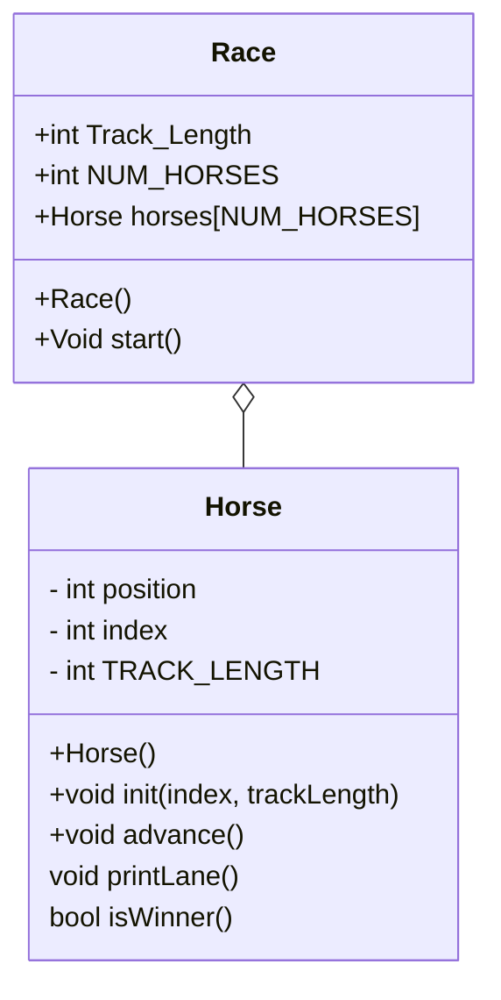

# OOp_horse_race

"include.h"
RACE CLASS
Race ()
  in header
    set const static int NUM_HORSES =5;
    initialize the TRACK_LENGTH to 15;
    initialize the horse array
  in constructor
    go through each horse
    initialize that horse with id and track length

  void start ()
  setkeepGOing to true
    while keepGoing
      for each horse:
      advance that horse
        if that horse is finished
          announce the winner
            set keepGoing to false

  Horse Class
  class Horse {
    private:
      int position;
      int id;
      int trackLength;
    public:
      Horse()
      void int(int id, int trackLength);
      void advance();
      void printLanne();
      bool isWinner();
      };

`void advance()`

flip a coin (0 and 1) and add it to the **position of the horse** who's **id** is passed into this function.
return the value of the horse's position. 
`printLane()`
    for i from zero to TRACK_LENGTH
        if current loop index is equal to the horse's value
            print horse's number'
        else:
            print '.'
        

      
  `Main`
  seed random generator
  inititaterace instance and start the race

